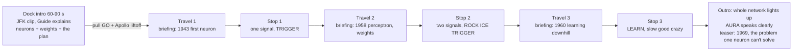
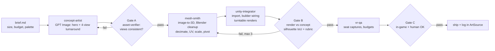

# TASK — Ride v3 "Ignite" Master Plan

| Field | Value |
|---|---|
| Status | Ready to execute. Written 2026-10-09 from the teacher meeting and a seat-camera audit of `NeuralRide.unity`. |
| Owner | Executing agent (Sonnet) + human for audio choice and the headset run |
| Goal | A ride a stranger can put on at **Ignite** (a public live demo), understand without help, and remember. |
| Supersedes | Phase B items in `IN_PROGRESS.md`. ADR-011 stays the base. |

> **Read this whole file before touching anything.** Every section says **why**. If you want to do something
> differently, write the reason in this file first and ask the human. Do not quietly "simplify" a step.

---

## 0. The five rules that matter most

1. **The scene is generated.** All scene/prefab changes go through `Tools/Editor/NeuralRideBuilder.cs` and a re-run of
   `Convergence > Build Neural Ride`. Why: hand edits to `NeuralRide.unity` are overwritten by the next build. That is how work gets lost.
2. **Prove it with pixels and numbers, not words.** After every visual change, capture the seat view (section 8) and look at it.
   Why: the old task logs said "done" while captures were never judged (ADR-011, Context). That is how we shipped poles over the UI.
3. **You cannot hear.** Never judge voice or music quality yourself. Render options, then the human picks.
4. **No slop gate.** A generated asset ships only after it passes Gates A, B and C (WP7). Failing twice means stop and report.
   Keeping the primitives is better than shipping a melted mesh.
5. **Layer rules from `AGENTS.md` still apply.** Core stays Unity-free. Presentation never decides correctness. Generated meshes are never interactable and never orange.

---

## 1. What the teacher and the team asked for → where it's handled

| # | Request (from the meeting) | WP |
|---|---|---|
| 1 | A narrated **intro before the game**: what the game is, what we'll do, with real pauses. Thorough but not long. | WP3, WP4 |
| 2 | Explain **what weights are** (and neurons) before the first puzzle. | WP4 (intro script) |
| 3 | Before **each mini-game**, explain what is happening and why we're doing it. | WP3 (briefings), WP4 |
| 4 | Better voices: drop the current recordings. A good AI narrator **plus a famous, recognizable voice**, free, **not AI slop**: expressive, natural pauses. | WP4 |
| 5 | **The UI is hidden behind poles.** | WP2 |
| 6 | **Background music too loud** (the next classroom heard it). | WP1 |
| 7 | Tell the **proper story of AI**. Note anything structurally wrong for a future restructure. | WP4, WP9 |
| 8 | **Bigger, more beautiful neural net.** It was covered up. | WP2, WP5 |
| 9 | The **cart ride is bland.** Make travel exciting. | WP5, WP6 |
| 10 | **Subagents + skills + GPT Image concept art (multi-view) → 3D models → MCP → Unity CLI**, built into the folder structure so we reuse it. Only if it's done well. | WP7 |
| 11 | Visually awesome overall. | WP5, WP6, WP7 |
| 12 | Works and is interactive **in the VR headset**, nothing blocked. Tested. | WP2, WP8 |
| 13 | A **checklist** so nothing is missed. | Section 10 |
| 14 | Future agents know about **Ignite**. | Section 9 |

---

## 2. What is wrong today (measured 2026-10-09)

Captures were rendered from the pod seat in the Editor. Section 8 explains how to re-shoot them.

| Standing player, stop 1 | Seated player, stop 2 |
|---|---|
|  |  |

More views are in `Documentation/Design/captures/ride_v2_baseline/` (dock, stop 2 looking up, stop 3).

| Problem | Evidence | Cause in code |
|---|---|---|
| **Poles over the UI** | Two posts slice the network diagram (left) and the case board (right). | `BuildPod()` posts at ±38° azimuth, radius 1.45 m. Diagram center ≈ 28° left, board ≈ 33° right, so the posts land on both panels. |
| **Canopy hides the neuron core** | Standing view: the "teeth" along the top cover `fire at 0.5` and the tank. | Rim at y = 2.0 m, r = 1.45 m sits **13.6°** above a 1.65 m eye. Core center (y 3.3, z 7) sits at **13.3°**. Same spot. |
| **Eye height is not controlled** | Stuff is fine seated and blocked standing. | XR Origin `m_RequestedTrackingOriginMode: 0` (floor), so eye height is the player's real height. At Ignite most people stand. |
| **The neural net is tiny and off to the side** | One neuron diagram at 28° left behind a pole. The core sits behind the scanner arch. | `BuildStation()` layout. |
| **Everything reads flat** | Grey discs and boxes, no depth. | Every material is `URP/Unlit` with a flat color. No rim light, no shading cues. |
| **Bland travel** | Dock view: cyan wire rings and a few dots. | `BuildTrack()` has rings, rails and 160 orb quads only. |
| **Music too loud** | `telstar.wav` is mastered hot: RMS **−11.4 dBFS**, peak 0 dBFS. Voice lines RMS ≈ **−15 dBFS**. | `RideMusic.volume = 0.5`, which leaves music only ≈ 2–3 dB under the voice. It's a 2D source, so it plays full-volume in both ears. |
| **Robotic or temporary voice** | 15 lines, short, no intro, no briefings. | `DashScreenView.Subtitles[]` is hard-coded and `RideLine` has only 15 ids. |

---

## 3. Target experience (one picture)

Story logic, so you understand the why: the pod flies **through a big, glowing, layered neural network** (the ship's brain). Each stop docks at **one neuron of that network**. Solving a stop lights that neuron's connections in the big network. At the end the whole network glows. The player *sees* "one neuron → many neurons = a network", which fixes the honest gap in `TEAM_BRIEFING.md` ("we only show one neuron").

---

## 4. Work packages (do them in this order)

Each WP gets a small commit. Run the narrowest tests, report every command and its output (AGENTS.md).

### WP1 — Music volume (quick win, do first)

**Why first:** ten minutes of work, and it fixes the complaint everyone noticed.

- `RideMusic`: `volume` 0.5 → **0.14**, `duckedVolume` 0.2 → **0.05**. Set them from the builder so a re-build keeps them.
  Math: −11.4 dBFS + 20·log10(0.14) ≈ **−28.5 dBFS**, about 13 dB under the voice. Ducked ≈ −37 dBFS, about 22 dB under.
- Add `Assets/_Project/Audio/Mixers/RideMixer.mixer` with groups **Music / Voice / SFX** and exposed volume params. Route the sources from the builder.
  Why: a later tweak becomes one number, not a code hunt.
- Add a `RideAudioLevels` check to the builder that fails the build if the music volume is > 0.2.
  Why: regressions get caught, not re-reported by a teacher.
- Licensing flag, one line in the ADR: if `telstar.wav` is the 1962 Tornados recording, that is commercial music. For a public Ignite demo, either confirm the license in writing or swap in a CC0 space track.
- **Done when:** builder re-run, the values in the scene are 0.14/0.05, the test passes, and the human confirms in headset at 50% Quest volume that the voice is clearly on top.

### WP2 — Sightlines: nothing may block the view, at any height

**Why:** the #1 headset complaint. Fix it with a *rule enforced by a test*, not by eyeballing once.

1. **Normalize eye height** (`XR/Ride/PodSeat.cs`): once the headset is tracking, and again on recenter, offset the rig so the eye sits at **1.30 m** above the pod floor, standing or seated.
   Why: you can then lay the station out for one known eye height. Do not switch the tracking mode, which needs the device to test. Offset the rig instead.
2. **Rebuild the pod in `BuildPod()`:** delete the 4 posts and the 24-segment overhead rim.
   Replace them with a **low cockpit tub**: sides up to ~1.0 m, a rear headrest arc, thin glowing trim, and no geometry above 1.1 m in the forward ±70°.
   Why: the posts and rim exist only for "pod feel". A low tub gives the same safety and framing without crossing the view.
3. **Viewing-cone layout** for every station panel. From a 1.30 m eye, keep all teaching content inside **±35° horizontal and −20°…+22° vertical**, at 3–6 m.
   Text cap height must be ≥ **2°** (≥ 0.10 m at 3 m). Why: outside that cone people miss things in a headset. Small text is unreadable on Quest 2.
4. **Sightline validator** (new `Tools/Editor/RideSightlines.cs` plus an EditMode/Editor test).
   For each stop, cast rays from eyes at **1.15, 1.30 and 1.45 m** to the corners and center of every teaching panel: diagram, board, equation, core, landscape, dash screen.
   Fail if any ray hits pod or station geometry first. Pod primitives have no colliders, so use `Renderer.bounds.IntersectRay` or temporary MeshColliders.
   Call it from the builder like `AssertOnlyRideRootsRender()`. Why: this makes "poles over the UI" impossible to reintroduce.
- **Allowed:** `Tools/Editor/NeuralRideBuilder.cs`, `Tools/Editor/RideSightlines.cs`, `Assets/Scripts/XR/Ride/PodSeat.cs`, `Tests/EditMode/**` (new test), `Assets/Prefabs/NeuralRide/*` (regenerated).
- **Done when:** the validator is green, the 3 stops × 3 heights captures show no occlusion, and the stop panels sit inside the cone.

### WP3 — Narration system: intro, briefings, real pauses

**Why:** the teacher's main ask. The current system can't do it. There are 15 hard-coded lines, and narration never gates gameplay, so a lesson gets cut off by the puzzle starting.

Design (keep the layers clean):
- **Gameplay** (`Gameplay/Ride/`):
  - Append new ids to `RideLine` and **never renumber 1–15**. Filenames depend on the numbers.
  - Add a `RideScript` ScriptableObject: an ordered list of `{RideLine line, float seconds}` for the **Intro**, **Briefing 1–3**, and **Outro** sequences.
  - `seconds` = clip length + `pauseAfter`, written by the builder from the clips.
  - Why: Gameplay paces the ride from numbers and never touches AudioClips. That keeps it testable without audio and matches ADR-011's "recordings replaced by filename + builder re-run".
- `RideDirector`:
  - Add the `Intro` state. GO stays locked until the intro ends.
  - Each travel lasts at least as long as that stop's briefing. `station.Begin()` runs only after the briefing ends, so levers go live when the lesson is done.
  - **Operator skip**: hold GO 2 s, or press `Space` on desktop, to skip the intro. Why: Ignite has a line of people. Repeat demos need a skip, first-timers get the full intro.
- **Presentation**:
  - Add a `NarrationLibrary` asset (subtitle + clip per `RideLine`) that replaces `DashScreenView.Subtitles[]`. Subtitles stay on screen. Why: a loud venue, and accessibility.
  - Show a big **chapter card** during briefings (e.g. "1943 · THE FIRST NEURON") inside the viewing cone.
- **Tests:**
  - EditMode: every `RideLine` has a subtitle, clip and duration.
  - PlayMode: GO is ignored during the intro, skip works, and a station doesn't begin before its briefing ends.
- **Allowed:** `Assets/Scripts/Gameplay/Ride/**`, `Assets/Scripts/Presentation/Ride/**`, `Tools/Editor/NeuralRideBuilder.cs`, `Assets/ScriptableObjects/` (new script and library assets), `Tests/**`.

### WP4 — Voices, script, and the story of AI

**Script:** Appendix A is the draft. The human and teacher approve the wording before any audio is generated. Why: regenerating 30 lines because of one word wastes the day.

**Story of AI:** each stop is a real chapter of history. The current mechanics already match it, so no puzzle code changes:

| Stop | History | Why it fits |
|---|---|---|
| 1 | **1943** McCulloch and Pitts, the first artificial neuron: add the signals, fire past a threshold | Exactly stop 1's trigger |
| 2 | **1958** Rosenblatt's perceptron: each input gets its own weight | Stop 2. The player *is* the learning rule |
| 3 | **1960** Widrow and Hoff: measure the squared error, step downhill | Exactly stop 3: linear neuron, MSE, batch gradient descent |
| Outro tease | **1969** Minsky and Papert: one neuron can't do XOR, then the first "AI winter". **1986** backprop and hidden layers fix it | The planned XOR stop. This is the next restructure (WP9) |

**Cast:**
- **The Guide.** Your mentor and main narrator. An *original* wise-mentor voice: older, warm, calm, a little gravel, unhurried, slight British lilt.
- **AURA.** The ship AI you're teaching. Short lines. Early lines get a light digital-glitch filter and the final line is clean, so the player *hears* her learn.
- **Archival cameos (real and famous):**
  - JFK, Rice University 1962, *"We choose to go to the Moon..."* (the JFK Library lists the recording as public domain, ID JFKWHA-127-002). It opens the intro.
  - NASA Apollo 11 launch audio when GO is pulled. NASA audio is free to use for education with credit to NASA and no implied endorsement.

**Why not Obi-Wan or Yoda (read this, it's the important call):**
- A voice is part of a real person's likeness, and those characters are Disney/Lucasfilm property.
- Cloning them is not "free" just because the model is open source.
- Mainstream TTS terms forbid cloning a voice without consent.
- Ignite is a public event tied to the school.

The Guide gives the *feeling* the teacher wanted, and JFK and Apollo give the *recognizable famous voice*, legally and on-theme. If a teammate pushes for a celebrity clone, stop and ask the human.

**Voice bake-off (the human decides, not you):**
1. Candidates:
   - **Qwen3-TTS VoiceDesign** (open, designs a voice from a text description, runs on this RTX 3060 12 GB; confirm its LICENSE file).
   - **Chatterbox-Turbo** (MIT, emotion-intensity knob and `[sigh]`-style tags, can clone the voice A designs; its output is watermarked).
   - Hosted free tiers: **Gemini TTS in Google AI Studio** (style prompts, preview rate limits), and **ElevenLabs free** (strong quality, but the free tier is non-commercial and requires the credit "elevenlabs.io").
2. Render the same 3 test lines with each: a calm explanation, an excited reaction, and a line with a dramatic pause. Save them to `ArtSource/voice_bakeoff/`, label them **A/B/C/D without names**, and the human plus one classmate pick blind.
3. Lock the winner's settings (description, seed, reference clip) in `ArtSource/voice_bakeoff/VOICE_SPEC.md`, so every future line matches.

**Production rules (why: this is what makes it not sound like slop):**
- Generate **one sentence per call**, then assemble with explicit silences: 0.3 s between clauses, 0.7–1.0 s on story beats.
  Never rely on the model to pause. Pauses are set in the `pauseAfter` value.
- Loudness-normalize every voice file to **−16 LUFS, peak −1 dBFS** (`ffmpeg loudnorm`; install with `winget install Gyan.FFmpeg`). Mono, 48 kHz, filenames `vo_ride_NN.wav`.
- Keep a `.txt` sidecar per clip with source, model, voice spec and the exact text, like the existing sidecars.
- Credits screen and ADR-012 list every voice source and license.

**Time budget:** intro 60–90 s, each briefing 15–25 s, whole ride ≤ 8 min. Why: Ignite throughput, and attention.

### WP5 — The big neural network + exciting travel

**Why:** this is the "wow" and it teaches. Done right it costs very few draw calls.
- **`NeuralCoreView`** (Presentation) plus a builder section:
  - About 6 layers × 6–10 neurons, spanning the track, which threads *through* the layers.
  - Neurons are instanced glowing spheres with an additive halo billboard.
  - All connections are **one combined ribbon mesh** with a scrolling-pulse shader. Weight drives width and brightness, and pulses flow forward all the time, so it looks alive.
  - Budget: **≤ 8 draw calls for the whole network.**
- **Honest by design (stretch):** Gameplay owns a small Core `NetworkModel` with fixed seeded weights and runs a real forward pass. Presentation only draws the activations. Then "this is a real network running" is true.
- **Story hooks:** each station is a highlighted neuron in this network. On `StationSolved`, its connections light up. On `RideCompleted`, the whole net ignites.
- **Travel:**
  - Fly between layers, with synapse pulses racing past along the track.
  - Briefings play on a big chapter card ahead.
  - Speed and rotation rules stay as they are: yaw only, eased (ADR-011), so it isn't sickening. Nothing passes closer than 1.5 m to the head.
- **Allowed:** `Assets/Scripts/Presentation/Ride/**`, `Assets/Scripts/Gameplay/Ride/**` (model only), `Tools/Editor/NeuralRideBuilder.cs`, `Assets/Materials/NeuralRide/**`, `Assets/Shaders/` (new, add it to PROJECT_MAP).

### WP6 — Look upgrade (cheap on Quest 2, big visual gain)

**Why:** flat unlit primitives look like cardboard (see the captures). Rim light plus emissive gives depth with no real-time lights.
- One Shader Graph, **`Convergence/HoloLit`** (unlit-cost): base color, **fresnel rim** (cyan), emissive mask, optional pulse/scanline. Swap the hero materials over in `MakeMaterials()`.
- **No URP post-process bloom on Quest 2.** A full-screen pass on a tile GPU is expensive, so keep the additive glow billboards.
- Starfield and dust: one particle system or instanced quads.
- Optional font: an SDF font with Greek glyphs (e.g. Inter, OFL), so the equation can read `w·x ≥ θ` instead of ASCII.
- **Done when:** the before/after captures show clear depth on nodes and pod, and draw calls stay ≤ 100 with triangles ≤ 100k (Frame Debugger / Stats).

### WP7 — Asset Forge: concept art → multi-view → 3D → verified in Unity

**Why:** this is how small teams get crisp custom models. It is also how they get slop, so it runs behind hard gates and starts with one small pilot.
The full procedure is the skill **`.agents/skills/asset-forge/SKILL.md`**. The subagents are in **`.claude/agents/`**.

- **Pilot = the friendly repair drone** (stops 1–2). Why: small, seen up close, simple silhouette, no logic, trivial to roll back.
  Only after the drone passes A–C **and** the human approves do the rock, comet, ice chunk, then the pod tub, then the station neuron housing.
- **The verify loop** (what makes this not slop):
  - Gate A checks that the 4 views of the concept agree with each other.
  - Gate B renders the imported model in Unity **from the same 4 angles** and puts it side by side with the concept.
  - Gate B scores **silhouette IoU ≥ 0.80** per view (numbers, not vibes), plus a rubric: proportions, details, palette, orange rule, budgets.
  - Gate C looks at it from the seat in-game.
- **Tools on this machine:**
  - GPT Image: the API if `OPENAI_API_KEY` is set (paid, cents per image). Otherwise the agent writes `prompt.txt` and the human generates in ChatGPT or Google AI Studio and drops the files in.
  - Image-to-3D: **Hunyuan3D-2mv** shape runs locally (~6 GB VRAM). Texturing (~16 GB) and TRELLIS.2 (≥ 24 GB) don't fit, so use hosted options: the Hunyuan web studio, or Tripo's free tier plus its official MCP (alpha).
  - Blender (`winget install BlenderFoundation.Blender`) runs headless.
  - The Unity CLI and MCP for Unity do import and capture.
- **Folders:** `ArtSource/` (raw art, outside `Assets/` so Unity doesn't import 50 MB meshes) → approved mesh only into `Assets/_Project/Models/<AssetId>/`. Scripts go in `Tools/ArtPipeline/`.
- **Budgets (Quest 2):** prop ≤ 5k tris, pod ≤ 15k, ≤ 2 materials, textures ≤ 1024² ASTC. Whole scene ≤ 100 draw calls and ≤ 100k tris.
- **Don't:** use AI textures raw (grade them to the palette or use the HoloLit materials, so assets match each other), or make generated meshes interactable or orange.
- **If the pilot fails twice:** stop. Ship WP6 (which already looks far better), and write down what failed in `ArtSource/drone_repair/verify/report.md`.

### WP8 — Headset verification (non-negotiable before Ignite)

- **Quest Link play-through:** the human plays the full ride. Check: intro audible over the music, every lever grabbable with either hand, no UI blocked standing *or* seated, hints appear, no stuck states.
- **Standalone APK** (Android build): measure with OVR Metrics Tool. **72 fps held**, draw calls ≤ 100, tris ≤ 100k. Write the numbers into this file.
- **Fresh-player test:** one classmate who has never seen it plays with zero coaching. Write down every moment they hesitate. This is the teacher's "intuitive for a first-timer" bar.
- **Desktop fallback** still works (right-mouse look, left-drag levers), because it is the backup if the headset dies at Ignite.

### WP9 — Docs and the future restructure

- **ADR-012:** voice cast and the no-celebrity-clone decision, archival audio sources and licenses, the music level policy, Asset Forge tooling plus external services and licenses, and the `ArtSource/` directory.
- Update `TEAM_BRIEFING.md` (new intro, cast, history chapters, Ignite demo script), `PROJECT_MAP.md`, and `DECISIONS_INDEX.md`.
- **`Documentation/Design/STORY_OF_AI.md`.** Restructure notes for later, not this week:
  1. Add the XOR stop as chapter 4 (1969 → 1986 backprop, a hidden layer, error flowing backwards visibly).
  2. Add a "scale" finale (2012 deep learning, 2017 transformers, 2022 ChatGPT: same ideas, billions of weights).
  3. Consider letting the player *start* the big network dark and light it chapter by chapter.

---

## 5. Code best practices for this task

- Keep `RideLine` ids 1–15 stable. Append only.
- Data in ScriptableObjects (script, library, theme), logic in plain classes, MonoBehaviours thin. No magic numbers in views. Theme values live in `RideTheme`.
- Every new builder section ends with an assertion (sightlines, audio levels, budgets) that **throws** with an actionable message (`Tools/AGENTS.md`).
- No `Find` or `GetComponent` in `Update`. Cache in `OnEnable` and unsubscribe in `OnDisable` (match the existing views).
- No per-frame allocations in views. Pool or instance. Quest 2 GC hitches show as judder.
- Never delete or weaken a failing test. Investigate, and report it if unsolved.

---

## 6. How to work fast without breaking things

- **Parallel:** WP7 (pilot) touches only `ArtSource/`, `Tools/ArtPipeline/` and `.claude/agents/`, so it can run in its own session while WP1–WP3 run here. WP4 audio waits on the human's pick.
- **Unity access:** the Unity CLI (`unity status`, `unity command eval`, `unity command capture_game_view`; see `.agents/skills/unity-cli/`).
  For MCP for Unity, the human clicks **Window > MCP for Unity > Start Server** (port 8080, `.mcp.json`). Do **not** upgrade the package to v10 without an ADR.

---

## 7. What NOT to do (and why)

| Don't | Why |
|---|---|
| Hand-edit `NeuralRide.unity` or the prefabs | The builder overwrites them |
| Clone a celebrity or actor voice | Likeness rights and IP, and a public school event |
| Judge audio quality yourself | You can't hear. The human picks |
| Add URP bloom or real-time shadows | Quest 2 frame budget |
| Put raw AI meshes or concept PNGs in `Assets/` | Import bloat and slow builds. Use `ArtSource/` |
| Ship a generated asset without Gates A–C | That's the slop we're avoiding |
| Change Core math or `FORMULAS.md` | Nothing this week needs it |
| Say "done" without captures and command output | AGENTS.md "Required validation" |

---

## 8. Re-shooting the seat captures

Edit mode, scene clean, no Play.

For each stop:
1. Move the `Pod` to the `Station_N` transform.
2. Show only that station's `StationReveal` groups for its kind, and hide the `Finale` panel.
3. Put a temporary camera at eye heights 1.15 / 1.30 / 1.45 m (FOV 68, 1600×900), render it to PNG, then restore everything.

The 2026-10-09 baseline was shot this way through `unity command eval`. Turn it into a menu item `Convergence/Capture Ride Seat Views` in `Tools/Editor/` and save the output to `Documentation/Design/captures/ride_v3/`. Compare it against `ride_v2_baseline/` in every report.

---

## 9. Ignite (why robustness beats features)

Strangers will put the headset on in a noisy room, one after another.
- **Must have:**
  - Operator restart (desktop key `R`).
  - Intro skip.
  - Sane volume at 50% Quest volume, and subtitles.
  - No way to get stuck: the hint arrows already solve this, keep them.
  - ≤ 8 min per person.
  - Desktop fallback.
- If a feature threatens any of these the week before Ignite, cut the feature.

---

## 10. Master checklist

**Audio**
- [x] WP1 music 0.14 / ducked 0.05, builder check (mixer asset not created: no scripting API; headset check still open)
- [ ] Music license confirmed in writing, or swapped for CC0
- [ ] WP4 script approved by human and teacher (Appendix A)
- [x] Voices chosen by measurement at the owner's request (Kokoro bm_fable / af_heart), `VOICE_SPEC.md` locked; blind bake-off not run. [ ] One human listen (approve or swap)
- [x] All lines generated per sentence with explicit pauses, −16 LUFS / −1 dBTP, sidecars written, transcription-checked (28 of 28 bound)
- [x] JFK and Apollo clips trimmed, credited, sidecars written (`ArtSource/archival/SOURCES.md`)

**Narration flow**
- [x] WP3 `RideScript` + `NarrationLibrary`, intro state, GO locked during intro, skip works (hold GO 2 s, Space, R to restart)
- [x] Briefings gate each station, chapter cards shown
- [x] EditMode and PlayMode narration tests green (EditMode 86/86, PlayMode ride 8/8 after part 2)
- [x] Narration you can see: {cue} tags, explainer panel, network cues, solve lines never cut off, dock weight toy, sound effects (ADR-014)
- [x] Opening that hooks: first input within 15 s (measured 12.4 s), interactive wake-up and "make it fire" (ADR-015; part 2 handoff, sections 10 and 11)
- [x] Network legibility and prominence (part 2 handoff, sections 10 to 12)

**Sightlines and VR**
- [x] WP2 posts and rim removed, low tub pod. [ ] Eye-height normalization written (`PodSeat`), not yet tested on a headset
- [x] Sightline validator in builder and test, green at 1.15 / 1.30 / 1.45 m (fails the build; mutation test proves it catches a blocker)
- [x] All panels inside the viewing cone; text at least 1.5° (about 30 px on a Quest 2; the plan said 2°, see ADR-013)
- [ ] WP8 Link play-through, APK at 72 fps, ≤ 100 draw calls, ≤ 100k tris, numbers recorded
- [ ] Fresh classmate test done, issues fixed

**Visuals**
- [x] WP5 big network (2 draw calls), stations as highlighted neurons, lights up on solve and at finale
- [x] Travel upgraded (layers, pulses, chapter cards), comfort rules kept (yaw only, eased, nothing within 4 m of the axis)
- [x] WP6 HoloLit shader on hero materials; captures in `Documentation/Design/captures/ride_v3/` vs `ride_v2_baseline/`

**Asset Forge**
- [ ] WP7 `ArtSource/` + skill + subagents in place
- [ ] Drone pilot through Gates A–C with human approval, or failure documented
- [ ] Then rock, comet, chunk, pod tub, neuron housing, each through the gates

**Docs**
- [x] WP9 ADR-012 (Proposed) and ADR-013, DECISIONS_INDEX, PROJECT_MAP, TEAM_BRIEFING, STORY_OF_AI.md
- [x] `Validate-RepositoryLayout.ps1` (46 checks, 0 violations) and `Validate-CoreBoundaries.ps1` green

---

## Appendix A — Draft script (approve before generating)

`[p0.8]` = 0.8 s pause. Ids 1–15 keep their numbers. New ids are appended.

**Intro (dock, ~80 s)**
- 16 JFK (archival): *"We choose to go to the Moon in this decade and do the other things, not because they are easy, but because they are hard."*
- 17 GUIDE: Every great journey starts with a hard problem. [p0.8] Ours is inside this ship.
- 18 AURA (glitched): Targeting... offline. [p0.5] I can't tell a rock... from a friend.
- 19 GUIDE: That's AURA, the ship's mind. Her brain is a neural network: thousands of tiny decision-makers called neurons, all wired together. [p0.6] Something in it has gone wrong. [p0.4] So we're going in.
- 20 GUIDE: Look ahead. [p0.6] Every glowing point is a neuron. Every line is a connection. [p0.5] And every connection has a number called a **weight**: how much one neuron listens to another. [p0.8] Change the weights, and you change what the AI thinks.
- 21 GUIDE: We'll make three stops. [p0.4] One neuron with one signal. [p0.4] One neuron that weighs two signals. [p0.4] And last, we'll watch the machine teach itself.
- 22 GUIDE: Anything orange, you can grab. Everything else is just for looking.
- 1 GUIDE: When you're ready, [p0.4] pull the orange GO lever.
- 24 NASA (archival, on GO): Apollo 11 liftoff call.

**Briefing 1 (travel, ~20 s)**
- 25 GUIDE: Chapter one. Nineteen forty-three. [p0.6] Two scientists, Warren McCulloch and Walter Pitts, imagined the first artificial neuron. It adds up its signals, [p0.3] and if the total crosses a line, the trigger, [p0.3] it fires. [p0.8] Up ahead, rocks are mixed in with our friendly repair drones. Set the trigger so the neuron zaps rocks, and only rocks.

**Stop 1**
- 2 GUIDE: Rocks are slipping through. Lower the trigger.
- 3 GUIDE: Lower. [p0.3] The rock's signal needs to reach the line.
- 4 AURA: Whoa, you zapped a drone! [p0.4] Trigger's too low.
- 5 GUIDE: That's it. [p0.5] Signal times weight, compared to a trigger. [p0.6] That's all a neuron is: math.

**Briefing 2 (~20 s)**
- 26 GUIDE: Chapter two. Nineteen fifty-eight. [p0.6] Frank Rosenblatt's perceptron gave every input its own weight, like a volume knob. [p0.6] Now there are two sensors: rock, and ice. [p0.4] But the ice wire is plugged in backwards. A negative weight. [p0.6] Fix the weights so anything rocky or icy gets zapped. [p0.4] Today, you are the one doing the learning.

**Stop 2**
- 6 AURA: The ice sensor is wired backwards. [p0.3] It's draining my core.
- 7 GUIDE: Turn each pipe up or down. [p0.3] That number is the weight.
- 8 GUIDE: Every case is right. [p0.5] You just built an OR gate out of multiplication and addition.

**Briefing 3 (~22 s)**
- 27 GUIDE: Chapter three. Nineteen sixty. [p0.6] Bernard Widrow and Ted Hoff asked: what if the machine tuned its own weights? [p0.6] Measure how wrong it is, the error, [p0.3] then nudge every weight a little bit downhill. [p0.3] Repeat. [p0.8] A version of that idea still trains today's AI.

**Stop 3**
- 9 GUIDE: Hand-tuning is slow. [p0.4] Pick a learning rate, [p0.3] how big each step is, [p0.3] then pull LEARN.
- 10 GUIDE: This hill is the error. Lower is better. [p0.4] Watch the weights roll downhill.
- 11 GUIDE: That's gradient descent. [p0.4] Measure the slope. Step down it. Repeat.
- 12 AURA: Too big a step! [p0.3] I'm overshooting!
- 13 AURA: Converged. [p0.4] I found my own weights.

**Outro**
- 14 AURA (clean voice): Targeting restored. [p0.5] I learned it from you.
- 28 GUIDE: Weights, sums, triggers, and learning by rolling downhill. [p0.6] That's the heart of every neural network. [p0.4] Real ones just do it with billions of weights at once.
- 29 GUIDE: But in nineteen sixty-nine, researchers found a problem one neuron can never solve. [p1.0] That's our next ride.
- 15 AURA: Course locked. Taking us home, for now.

## Appendix B — Sources checked 2026-10-09

- JFK Rice speech recording, public domain per the JFK Library: https://www.jfklibrary.org/asset-viewer/archives/jfkwha-127-002
- NASA media usage guidelines (credit NASA, no implied endorsement): https://www.nasa.gov/nasa-brand-center/images-and-media
- Qwen3-TTS open release (January 2026): https://simonwillison.net/2026/Jan/22/qwen3-tts
- Chatterbox (MIT): https://huggingface.co/ResembleAI/chatterbox
- Open TTS overview: https://www.bentoml.com/blog/exploring-the-world-of-open-source-text-to-speech-models
- ElevenLabs free-tier publishing rules: https://elevenlabs.io/docs/help-center/legal/can-i-publish-the-content-i-generate-on-the-platform
- Hunyuan3D-2 / 2mv (open weights, multi-view): https://github.com/Tencent-Hunyuan/Hunyuan3D-2
- Tripo MCP (alpha): https://github.com/VAST-AI-Research/tripo-mcp
- Blender MCP: https://playbooks.com/mcp/ahujasid-blender

Re-check licenses at use time. These are summaries, not legal advice.
